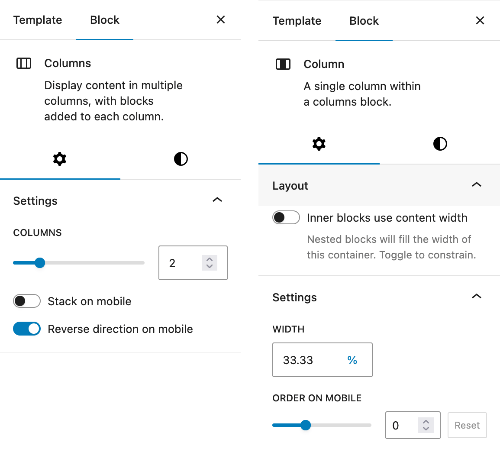

# Mai Column Order

Adds column order and direction controls for mobile and tablet layouts in the WordPress block editor.

## Description

Mai Column Order enhances the WordPress block editor by adding responsive column ordering capabilities. This plugin allows you to:

* Reverse the direction of all columns on mobile and tablet views
* Change the order of individual columns on mobile and tablet views
* Maintain desktop layouts while customizing mobile and tablet experiences

Perfect for creating responsive layouts where content needs to appear in a different order on smaller screens.

## Installation

1. Upload the plugin files to the `/wp-content/plugins/mai-column-order` directory, or install the plugin through the WordPress plugins screen directly.
2. Activate the plugin through the 'Plugins' screen in WordPress
3. Use the Column block settings sidebar to configure column order and direction for mobile and tablet views

## Usage

After installation:

1. Add or edit a Columns block in the WordPress editor
2. Select the parent Columns block to enable direction reversal for mobile and tablet views
3. Select individual Column blocks to set their order on mobile and tablet using the sidebar controls
4. Preview your page to see the responsive ordering in action

## Frequently Asked Questions

### Can I reverse the entire column order?

Yes! Select the parent Columns block and toggle "Reverse direction on mobile" or "Reverse direction on tablet" in the sidebar.

### How do I change the order of a specific column?

Select the individual Column block and use the "Order on mobile" or "Order on tablet" controls in the sidebar. Lower numbers appear first, higher numbers appear last.

## Screenshots

1. Column order controls in the block editor sidebar
2. Mobile and tablet direction controls for column groups

## Technical Notes

This plugin adds custom attributes and styles to core Column and Columns blocks. It uses CSS order properties and flex-direction to achieve responsive reordering without affecting the semantic HTML structure.

For developers, the plugin:
* Adds custom attributes to core blocks
* Implements responsive CSS using modern CSS features
* Uses React components for the block editor interface
